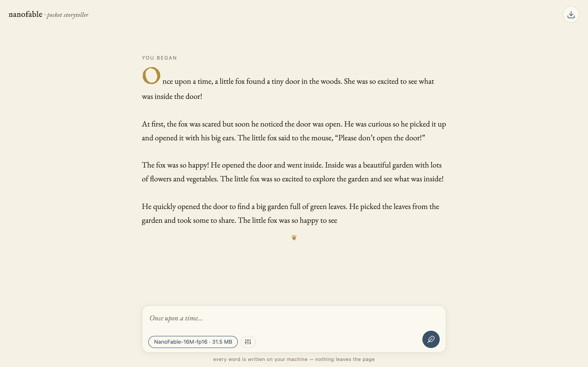
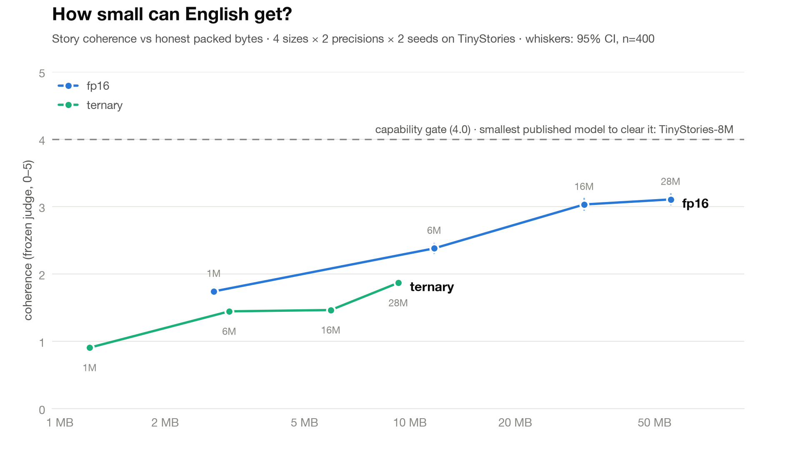

<div align="center">

<h1>nanofable</h1>


<p><i>how small can English get?</i></p>

<p>
  <b><a href="https://adit-rah.github.io/nanofable/">✒️ Write a story with Bar'd</a></b>
  &nbsp;·&nbsp;
  <a href="https://huggingface.co/spaces/adrahmana/nanofable">mirror on Hugging Face</a>
  &nbsp;·&nbsp;
  <a href="https://huggingface.co/adrahmana">model weights</a>
</p>

<p>
  <a href="https://github.com/adit-rah/nanofable/actions/workflows/pages.yml"></a>
  
</p>

</div>

I trained a family of 8 language models from scratch to find out where coherent English begins, and put every one of them in your browser.

Meet Bar'd. He weighs between 1.2 and 55 MB depending on which of him you load, he runs entirely in a browser tab (no server, no build step, no WASM toolkit: hand-written vanilla JS doing the inference), and if you hand him the first line of a story he'll write you the rest. All eight models are in the picker, each labeled with its judged coherence and size, so you can feel with your own eyes what an extra megabyte buys.

<div align="center">
<a href="https://adit-rah.github.io/nanofable/"></a>
</div>

nanofable is the harness behind him, and it exists to explore one question: **how small can a language model get, in honest packed bytes, and still write coherent English? And do ternary (1.58-bit) weights push that floor down?**

4 sizes x 2 precisions (fp16 vs ternary) x 2 seeds on TinyStories. 16 runs, everything else held steady, all of it scored by a frozen LLM judge against a bar we committed to git before the first run started. The whole sweep fit inside a free Kaggle GPU quota.

## the map

Nobody had drawn this curve before: prior ternary-vs-full-precision work at tiny scale is single-point comparisons. Here is the frontier itself, coherence against honest packed bytes, both arms, with 95% CIs:

<picture>
  <source media="(prefers-color-scheme: dark)" srcset="docs/frontier-dark.png" />
  
</picture>

The answer it gives is clean: **ternary didn't push the floor down.** At the sizes we measured, fp16 buys more coherence per byte, and we didn't find a crossing anywhere in the range.

Byte-matched, interpolating the fp16 curve to each ternary model's exact size:

| bytes | ternary coherence | fp16 coherence at the same bytes | ahead |
|------:|------------------:|---------------------------------:|-------|
| 3.05 MB |            1.444 |                            1.786 | fp16  |
| 5.94 MB |            1.463 |                            2.079 | fp16  |
| 9.27 MB |            1.867 |                            2.275 | fp16  |

The 1.58-bit compression is completely real: a ternary model is 0.44x the bytes of its fp16 twin at the tiny tier and 0.17x at the large one. It's just that the quality we give up costs more than the bytes we save. If you have 6 MB to spend, you currently get more out of spending it on fewer fp16 weights than on more ternary ones.

The parameter view tells the same story. `large_ternary` (27.8M params) scores 2.98 on grammar, and fp16 reaches 2.98 at roughly **2M params**. So ternary is paying about a **14x parameter cost** for a 6x byte discount. That trade doesn't pay off yet, at this scale.

Three things worth saying plainly, because they scope the result and they're where the next work comes from:

**This is a comparison at a fixed token budget.** Every run saw exactly 500M tokens, which keeps the two arms honestly comparable, but it isn't the same as comparing them at convergence. Nothing here converged, and finding 3 below shows ternary was the further from it. So the careful version is: *at equal training tokens, ternary loses the byte race at every size we measured.* Whether it closes the gap once it gets the longer budget it's clearly asking for is genuinely open, and it's the first thing we want to try.

**Both arms are still below our capability bar**, so these are two sub-capable curves being compared, not two capable ones.

**BitNet reaches ternary/fp16 parity at 3B+ params**, so a crossing very likely exists somewhere. It just doesn't seem to be down here at the emergence scale, which is the scale you'd actually want a 1 MB model for.

## where the models landed

Here's the whole sweep. Pooled across seeds, n=400 completions per config, greedy decoding, one frozen judge (the same numbers live in [`results/summary.csv`](results/summary.csv), generated straight from the run outputs, never hand-edited):

| config | params | bytes | coherence | grammar | consistency | completes | val PPL |
|--------|-------:|------:|----------:|--------:|------------:|----------:|--------:|
| tiny_fp16      |  1.4 M |  2.75 MB | 1.74 | 2.85 | 1.67 | 0.69 | 15.92 |
| small_fp16     |  5.9 M | 11.73 MB | 2.38 | 3.33 | 2.41 | 1.41 |  8.76 |
| medium_fp16    | 15.7 M | 31.46 MB | 3.03 | 3.77 | 3.15 | 2.17 |  6.34 |
| large_fp16     | 27.8 M | 55.57 MB | 3.11 | **3.83** | 3.23 | 2.26 |  5.67 |
| tiny_ternary   |  1.4 M |  1.22 MB | 0.91 | 1.91 | 0.70 | 0.10 | 53.60 |
| small_ternary  |  5.9 M |  3.05 MB | 1.44 | 2.53 | 1.38 | 0.42 | 30.04 |
| medium_ternary | 15.7 M |  5.94 MB | 1.46 | 2.57 | 1.39 | 0.42 | 18.09 |
| large_ternary  | 27.8 M |  9.27 MB | 1.87 | 2.98 | 1.80 | 0.82 | 13.35 |

Read the grammar column against the frozen rubric, where **4 means "minor slips that do not impede reading"** and **2 means "frequent errors, understandable but clearly broken."** The fp16 models at 15.7M and 27.8M land at 3.77 and 3.83: not error-free, but closing in on clean prose, with slips that mostly don't stop you reading. Grammatical storytelling really is showing up in an fp16 model somewhere in the mid-teens of millions of params. Ternary doesn't get there at any size we trained, yet.

The more interesting part is what *doesn't* keep pace. `large_fp16` writes near-clean sentences (3.83) and still only manages 3.23 on consistency and 2.26 on landing an ending. **Grammar arrives well before sense does.** The model has learned English and hasn't yet learned to hold a story in its head. Its val loss was still falling when the tokens ran out (finding 3), so this is a snapshot of a model mid-climb rather than a finished one, which is a nice thing to know: there's clearly more in there.

## three findings that outlive the numbers

**1. Coherence has a pecking order, and it looks universal.** grammar > consistency > completes-sensibly. All 8 sweep configs. All 5 published TinyStories checkpoints. And the real, human-written gold text (4.74 / 4.68 / 4.29). Fourteen out of fourteen, no exceptions. Models learn to shape a sentence long before they learn to hold state across sentences, and landing an ending arrives last. Even human prose tilts the same way, which suggests this is the shape of the task rather than an artifact of our models being small.

**2. Ternary taxes state more than syntax.** This is my favorite result here. At the large tier, going ternary costs 0.85 on grammar but **1.43 and 1.44** on consistency and completes, so roughly **1.7x the cost on the state-holding axes**. Ternary doesn't degrade a model evenly. It seems to take the structured, longer-range machinery first and leave surface fluency relatively intact. That helps explain *why* ternary is behind on bytes here, and it's a useful hint about where the bits are actually going.

**3. Quantized training is data-hungrier, and the appetite grows with scale.** Every run in this sweep was still learning when the tokens ran out. Here's the val-PPL drop over the *final 20%* of tokens, by which point the cosine has decayed to 10% of peak LR and a converged model should be nearly flat:

| tier   | fp16 still falling | ternary still falling | ratio |
|--------|-------------------:|----------------------:|------:|
| tiny   |               2.8% |                  2.8% | 1.0x  |
| small  |               3.0% |                  3.5% | 1.2x  |
| medium |               2.9% |                  3.7% | 1.3x  |
| large  |               3.3% |                  5.0% | 1.5x  |

Nothing converged, so 500M tokens is binding on *both* arms. But ternary is measurably further from the end of its own curve, and the gap widens with model size. Ternary is still descending while fp16 has started to level off. So quantization doesn't only cost quality at a fixed token budget, **it seems to raise the token budget you needed in the first place**, and to ask for more the bigger you build. Which also means every ternary number above is a floor, not a ceiling: these models never got the budget they were asking for.

## where that leaves us on the ladder

We scored every published TinyStories checkpoint through the exact same judge, so "how far off are we" has a real number attached:

| model            | coherence | grammar / consistency / completes |
|------------------|----------:|-----------------------------------|
| TinyStories-1M   |     2.423 | 3.31 / 2.46 / 1.50                |
| TinyStories-3M   |     3.330 | 3.92 / 3.50 / 2.58                |
| TinyStories-8M   | **4.232** | 4.55 / 4.42 / 3.73                |
| TinyStories-28M  |     4.447 | 4.67 / 4.58 / 4.08                |
| TinyStories-33M  |     4.378 | 4.64 / 4.54 / 3.95                |
| gold (real text) |         . | 4.74 / 4.68 / 4.29                |

`large_fp16` lands right on TinyStories-3M, statistically indistinguishable from it, and the smallest published checkpoint clearing 4.0 is the 8M. So we're about one rung short, on a ladder we can now see end to end, with a calibrated instrument pointed right at the gap. That's a nice place to be picking things up from.

## the vocab sacrifice

This one decision is what made any of the above measurable, and it's the part of the design I'm happiest with. We train our own 4,096-token BPE tokenizer instead of reaching for GPT-2's 50k.

Embeddings don't ternarize; they stay fp16 in both arms. So with a 50k vocab a "tiny" model is mostly embedding table (~6.4M embedding params before a single layer of compute), ternarizing the blocks would buy almost nothing, and the two curves would collapse on top of each other. The experiment would have measured nothing at all.

Shrink the vocab and the blocks dominate again, so the ternary savings become visible:

| tier   | params | fp16     | ternary | embed+head | ternary/fp16 |
|--------|-------:|---------:|--------:|-----------:|-------------:|
| tiny   | 1.38 M |  2.75 MB | 1.22 MB |    1.05 MB |    **0.442** |
| small  | 5.87 M | 11.73 MB | 3.05 MB |    2.10 MB |    **0.260** |
| medium | 15.7 M | 31.46 MB | 5.94 MB |    3.15 MB |    **0.189** |
| large  | 27.8 M | 55.57 MB | 9.27 MB |    4.19 MB |    **0.167** |

Ternary's compression ratio gets *better* as models grow, because only the body ternarizes. There's a gentle irony in that: ternary bends the byte curve hardest up where you least need a small model, and helps least down at the floor where you want it most. Good to know, and a useful thing to design around next time.

One tested function defines every number in that table: `count_bytes()` in `src/nanofable/bytes.py`. Block weights at 1.58/8 each, embeddings + tied head at fp16, per-layer scales counted honestly. The headline rides on it being right, so it has its own test file plus a test that guards the vocab decision at every tier.

## the bar, frozen before anything ran

"Smallest capable model" doesn't mean much unless you say what *capable* means before you look. So we wrote it down first, in git: the rubric, the 200 held-out prefixes, the judge (`Qwen2.5-7B-Instruct`), and the judge prompt, all committed before run one.

Capable iff both:

- **coherence:** mean judge score >= 4.0 / 5, averaged over grammar / consistency / completes, on the fixed 200 prefixes.
- **perplexity:** val PPL <= 1.5x the best fp16 val PPL in the sweep. The *rule* is frozen; the number resolves once the fp16 runs land. We fix the policy, not the answer.

**Nothing cleared 4.0.** `large_fp16` came closest at 3.11. So "smallest capable model in bytes" is still open, and that's the honest gap in this project right now.

The gate still earned its keep. `medium_fp16` and `large_fp16` both sail through the perplexity gate (T = 8.089) and still fall short on coherence. **Perplexity turns out to be necessary but not sufficient.** A PPL-only study, which is what the prior ternary work on TinyStories was, would have looked at these models and seen success. Reading their actual completions, they're not there yet. That's a good reason to keep a judge in the loop.

### what's holding us under the bar

The **500M-token budget** is the prime suspect, and finding 3 is the evidence: every run, both arms, was still descending when the tokens ran out. Not one model in this sweep trained to convergence. We're reporting where eight models had *gotten to* at 500M tokens, not where they were headed, and the ternary arm was furthest from done. That's an encouraging thing to be wrong about, because it's the cheapest possible fix.

Two other suspects, both easy to test, and the harness is already built to test them:

- the **4k vocab**, which makes every token a harder prediction than the published models' 50k.
- the **shared 3e-4 LR**, which may suit one arm better than the other.

## the freeze that caught its own bug

This is the part I'd most want someone else to take away from the project: the pre-registration discipline didn't just sit there looking virtuous, it caught a live instrumentation bug before it could contaminate the results.

Midway through, the sampled judge scores came back much lower than expected. The audit turned up the reason: decoding policy was never in the freeze list. The calibration references had been scored decoding-free or greedy, and the sweep models were being scored on temperature-1.0 / top-k-40 samples. Nobody had written down which, so nobody noticed they'd drifted apart.

Score the known-good TinyStories-33M under that same sampled policy and it comes out at 3.687, below our own 4.0 bar. The gate had floated up above what a strong reference model can reach, so it could no longer tell a good model from a weak one.

If the sweep had happened to clear that gate, we'd have reported something that didn't mean anything. Instead the frozen-artifact habit surfaced it, and we re-froze greedy decoding uniformly across every model and every reference (the only policy the original calibration had actually validated). We did that blind, before a single greedy sweep score existed, which is what makes it an instrument correction rather than quietly tuning the gate until we liked the answer. Keeping the artifacts in git is the only reason we can tell those two apart after the fact.

The discipline paid for itself here, and it's cheap to set up. Recommended.

## Bar'd, in your browser

Models ship as `.tpack` files (magic `TCP1`), and this is where the byte savings stop being a spreadsheet and become a file: ternary weights packed at **5 trits per byte**.

That matters more than it sounds. Torch-native formats have no sub-byte dtype, so a "ternary" safetensors file stores every trit in a full fp16 slot and comes out *exactly as big as the fp16 model*. All the compression this project measures is theoretical until you actually pack it:

| tier   | `model.safetensors` (either arm) | ternary `.tpack` |
|--------|---------------------------------:|-----------------:|
| tiny   |                      2,758,256 B |  **1,225,952 B** |
| medium |                     31,477,256 B |  **5,999,152 B** |

Same bits, different storage. The release ships both: safetensors for standard tooling, `.tpack` as the honest small artifact.

`web/` loads one, unpacks the trits once, and runs the ternary kernel client-side:

```sh
python scripts/pack_model.py --ckpt local/tiny_ternary_0.pt --tier tiny \
    --precision ternary --out web/models/tiny_ternary.tpack
python3 -m http.server 8000 -d web    # ES modules + Cache API want http, not file://
```

Python and JS produce bit-identical greedy output, verified token for token. Getting there meant rounding the absmean scales to fp16 *before* writing them so both sides dequantize off the same values. It's the reason I trust the JS kernel, and it means the model in your browser is the same one the judge scored, not a lookalike.

Bar'd is a story completer, not a chatbot. He was raised on TinyStories. He will not answer your questions, and he does not consider that a bug.

He also emits mojibake now and then, which is the dataset's fault and honestly kind of charming. TinyStories stores curly punctuation CP1252-double-encoded (a `“` is literally the three characters `“`), those sequences earned their own BPE merges, and the model faithfully learned to produce them. We repair it at render time only. The tokenizer, dataset, and token ids stay untouched, because cleaning the corpus would invalidate every completed run, and the judge sees the same mojibake for every config, so the comparison stays consistent.

## setup

```bash
python3 -m venv .venv
.venv/bin/pip install -r requirements.txt
.venv/bin/python -m pytest        # 106 tests, offline, no GPU
```

## the pipeline

| # | step | command | output |
|---|------|---------|--------|
| 1 | tokenizer *(frozen)* | `scripts/build_tokenizer.py` | `artifacts/tokenizer/tokenizer.json` |
| 2 | data | `scripts/build_dataset.py` | `artifacts/data/{train,val}.bin` |
| 3 | prefixes *(frozen)* | `scripts/make_prefixes.py` | `eval/prefixes.jsonl` (200) |
| 4 | calibration *(frozen)* | `scripts/run_calibration.py` | `eval/calibration.md` |
| 5 | sweep | `scripts/run_sweep.py` | `runs/<tier>_<prec>_<seed>/` |
| 6 | summarize | `scripts/summarize_results.py` | `results/summary.csv` |
| 7 | plot | `scripts/plot_frontier_showcase.py` | `docs/frontier.png` (+ dark variant) |

Steps 1-3 are one-time artifacts committed *before* the sweep. That's what makes "frozen" enforceable by version control instead of by my good intentions. Steps 4-5 want a GPU, and the good news is the whole 16-run sweep is only 10-20 GPU-hours, which fits inside Kaggle's free weekly quota. Sessions cap at 12h so every run checkpoints, and the sweep is idempotent: kill it, re-run it, finished runs get skipped. Step 6 distills the raw run outputs into the committed `results/summary.csv`, and step 7 renders the frontier figure from that file alone, so both are reproducible from what's in the repo. (`scripts/plot_frontier.py` is the original spec deliverable and still reads raw run dirs directly.)

One caveat worth stating plainly. Ternary is cheaper to ship and *more* expensive to train, because you carry a full-precision latent weight and quantize it on every forward pass. "Smaller in bytes" and "cheaper to train" point in opposite directions, so we log and report both. Compute is recorded per run (FLOPs ~ 6*N*T, plus wall-clock).

## layout

- `src/nanofable/` model (`model.py`, `bitlinear.py`, `rope.py`), byte accounting (`bytes.py`), data, training, sweep, `.tpack` packing.
- `eval/` the frozen rubric, judge prompt, and 200 prefixes; judge backends, capability gate, eval runner.
- `results/` the committed sweep distillate (`summary.csv`): every number in this README, inspectable.
- `specs/` the frozen spec we're building against.
- `docs/` why the frozen config is what it is, byte accounting, the emergence-floor estimate, related work, the figures.
- `web/` Bar'd.
- `tests/` mirrors `src/` and `eval/`. Offline, no GPU.

`runs/` and `artifacts/data/` are generated and gitignored. Results are never hand-edited: runs log to CSV, the summarizer reads the runs, and the plotting script reads the summary.

## what's next

The frontier question has an answer. The capability question doesn't yet, and the space between those two is basically the roadmap.

Push the token budget first. Nothing converged, every arm was still descending at 500M tokens, and ternary was furthest from done, so that single experiment improves the capability question and the fairness of the ternary comparison at the same time. Train long, see whether the fp16 curve crosses 4.0 and where, and see how much of the gap ternary closes once it gets the tokens it was asking for. Then add a 2-bit arm: ParetoQ found 2-bit and ternary roughly tied at large scale, which makes the tiny-scale comparison the open and interesting one, and a sharper target than the 4-bit idea we started with.

Then the big one, the question all of this is really pointing at. The emergence floor is a property of *the distribution*, not of English. TinyStories engineered a world simple enough for ~1M params. Constrain that world harder and the floor should slide down with it. How far down does it go? That's the fun part, and we're only just getting to it.
